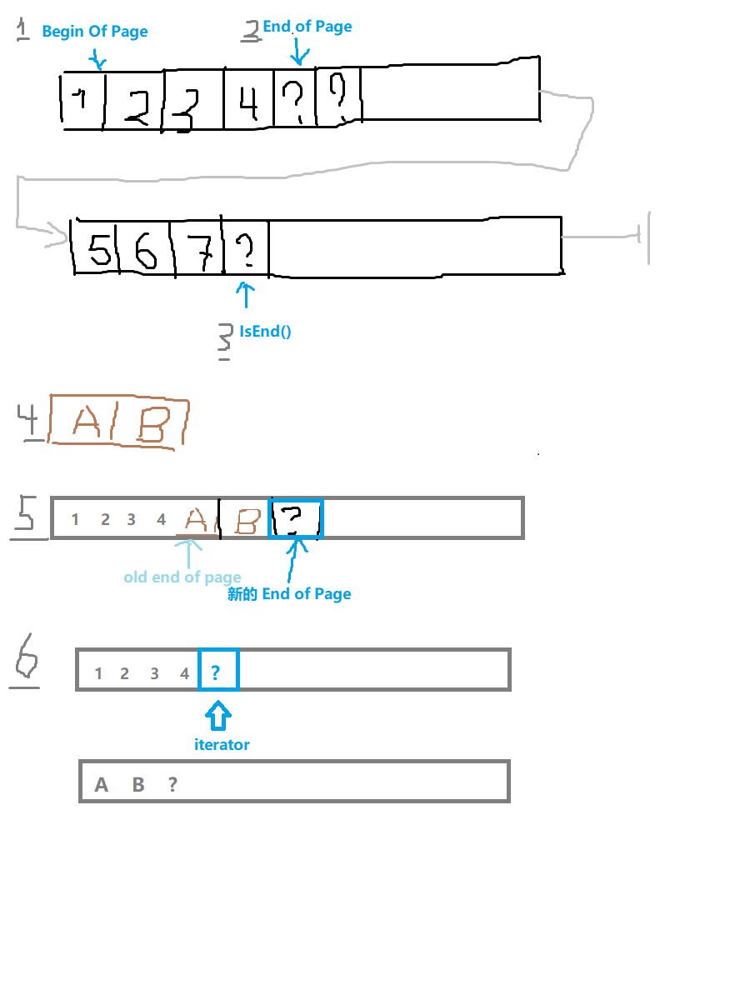

## 基本功能

和普通迭代器不同的是在Page与Page之间有一个EndOfPage 状态(2)，这时候指针指向一片无效的数据，这时候 `*itr` 的数据是会迫使迭代器进入下一页，但是在这个 EndOfPage 状态你可以插入数据，比如图中把(4) 在EndOfPage 插入数据后边成(5)

还有一个叫做split page，会把指向的数据和之后的数据都移到下一个新的页里。比如(5) 的情况下如果迭代器指向old end of page 会把从指向开始的所有元素搬到下一个页，这时候迭代器没有改变位置，所以他变成了End of page。

如果要把这一页一分为二的话，就先调用 `MoveToPageCenter()` 把迭代器指向中间位置，再调用`SplitPage()`

## 细节信息

`Page` 是硬盘的一页，默认16KB， 可以直接加载到内存访问，由三部分组成：

- `header` page 的描述头
- `data` 
- `nil table/ offset table` 如果是边长的话是 offset table, 反之是 `nil table`,从page 尾部逆序存储

多个Page 可以前后连接形成链表。

`iterator` 相当于 `BufferManager` 的便利接口，可以像正常的STL 迭代器那样访问，提供 API 可以像访问数组一样访问访问在硬盘上的Page链表

- 后台机制：
  - 在内存里遍历Page，如果当前 Page 到读完了自动调用 `BufferManager`  把下一页加载到内存继续访问
- 可以使用`itr++`, `itr--` 的方式移动光标，计划以后支持`itr + 10`这种方式
- `*itr` 可以返回当前指向内容的引用
- `IsNil()` 表示当前数据在 `nil table` 里是否是 `nil`, 如果当前是`nil()` 的话，`*itr` 不应该被调用

- `IsEnd()` `IsBegin()` 返回当前指针是否指向初始元素和page最后的元素，

制造一个迭代器需要一个

- `OpenFile` 打开一个文件，斌且获得文件的句柄`FileId`\
- 调用`GetPage`